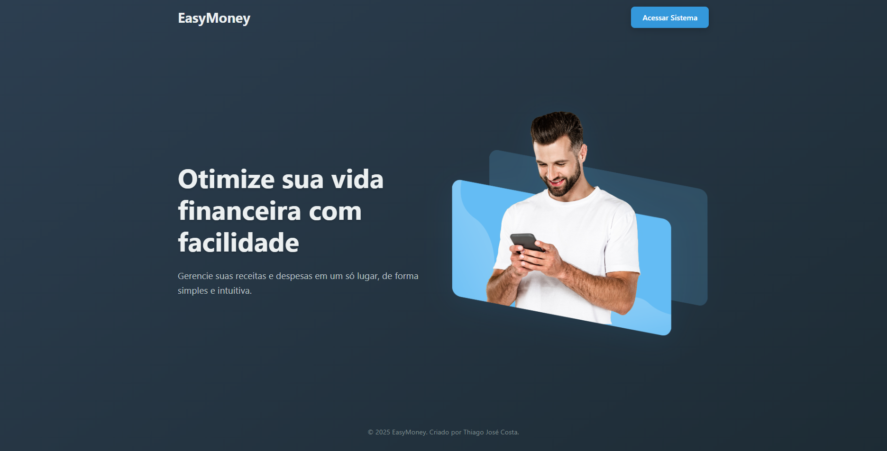
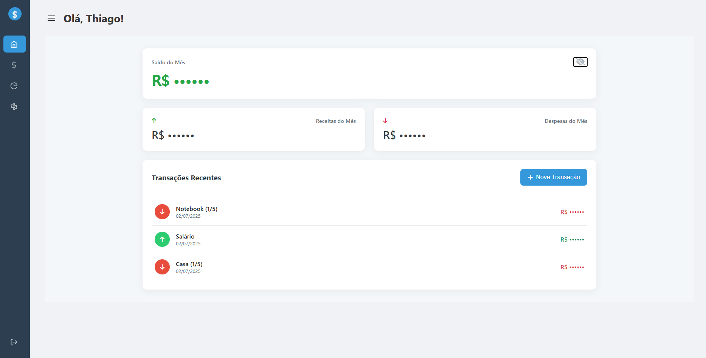
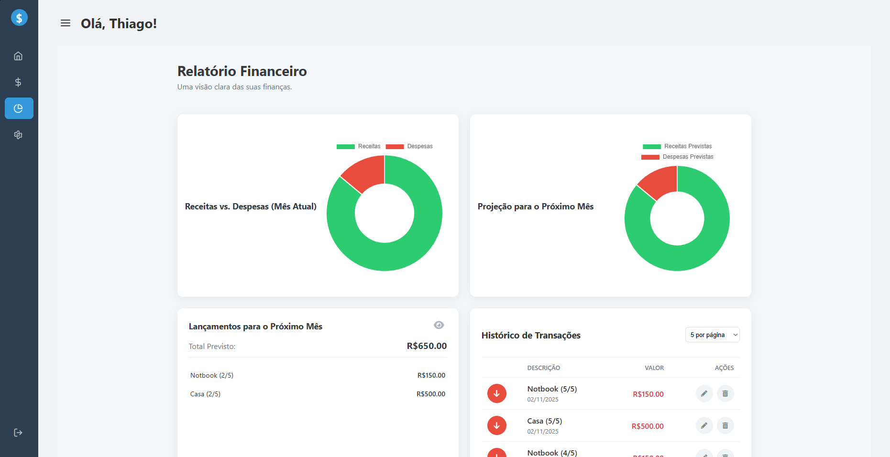
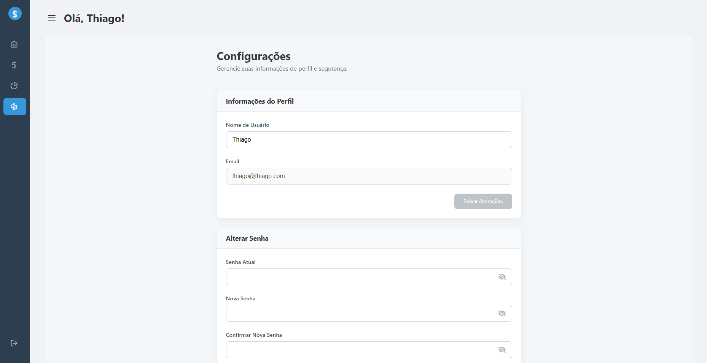
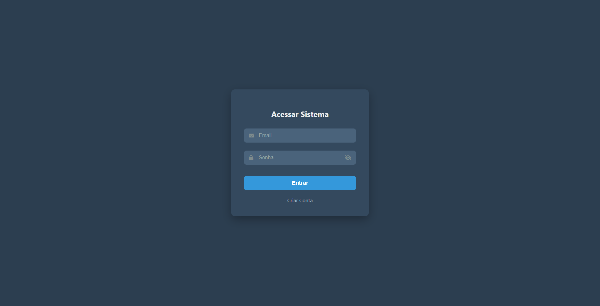
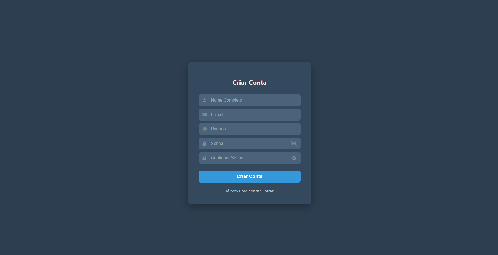

# Controle Financeiro Pessoal 💰



## 📝 Sobre o Projeto

Este é um projeto de um sistema de Controle Financeiro Pessoal, desenvolvido como atividade para a matéria de **Oficina de Desenvolvimento Web** do curso de Análise e Desenvolvimento de Sistemas do **IFPR - Campus Palmas**.

O objetivo principal foi criar uma aplicação **Single-Page Application (SPA)** moderna e interativa, focada em proporcionar uma excelente experiência ao utilizador na gestão de suas finanças. A aplicação permite que o utilizador se registe, controle as suas receitas e despesas, e visualize relatórios claros sobre a sua situação financeira.

---

## ✨ Funcionalidades Principais

O sistema foi desenhado para ser uma ferramenta completa e intuitiva. As suas principais funcionalidades são:

- **🔐 Autenticação de Utilizador:** Sistema seguro de Registo e Login para proteger os dados.
- **📊 Dashboard Principal:** Uma visão geral e imediata da saúde financeira do mês atual, com saldos, total de receitas, total de despesas e as transações mais recentes.
- **💸 Gestão de Transações:**
  - Adição de novas receitas ou despesas através de um formulário intuitivo em pop-up.
  - Funcionalidade de transações **recorrentes** (como salários) e **parceladas** (como compras a prazo).
  - Edição e exclusão de regras de transação diretamente das listas.
- **📈 Relatórios Detalhados:**
  - Gráficos de pizza que comparam as receitas e despesas do mês atual.
  - Projeção visual para o próximo mês, ajudando no planeamento financeiro.
  - Histórico completo de transações com paginação.
- **⚙️ Configurações de Perfil:** O utilizador pode alterar o seu nome e a sua senha de acesso.
- **👁️ Modo de Privacidade:** Funcionalidade para ocultar/mostrar todos os valores monetários da tela, garantindo a privacidade do utilizador.

---

## 📸 Screenshots

<table>
  <tr>
    <td align="center"><strong>Página Inicial</strong></td>
    <td align="center"><strong>Dashboard Principal</strong></td>
  </tr>
  <tr>
    <td></td>
    <td></td>
  </tr>
  <tr>
    <td align="center"><strong>Relatórios Financeiros</strong></td>
    <td align="center"><strong>Configurações de Perfil</strong></td>
  </tr>
  <tr>
    <td></td>
    <td></td>
  </tr>
   <tr>
    <td align="center"><strong>Login</strong></td>
    <td align="center"><strong>Criar Conta</strong></td>
  </tr>
  <tr>
    <td></td>
    <td></td>
  </tr>
</table>

---

## 🚀 Como Executar o Projeto

Para executar este projeto localmente, siga os passos abaixo.

### Pré-requisitos

Antes de começar, você vai precisar ter as seguintes ferramentas instaladas na sua máquina:

- [Git](https://git-scm.com)
- [Node.js](https://nodejs.org/en/) (que já vem com o npm)
- [Angular CLI](https://angular.io/cli) (`npm install -g @angular/cli`)

### Clonando e Instalando

```bash
# 1. Clone o repositório para a sua máquina local
git clone [https://github.com/seu-usuario/seu-repositorio.git](https://github.com/seu-usuario/seu-repositorio.git)

# 2. Navegue para a pasta do projeto
cd seu-repositorio

# 3. Instale todas as dependências necessárias
npm install
```

### Executando a Aplicação

```bash
# Execute o comando abaixo para iniciar o servidor de desenvolvimento
ng serve --open
```

A aplicação abrirá automaticamente no seu navegador no endereço `http://localhost:4200/`.

---

## 🗄️ Armazenamento de Dados

Para este projeto, todos os dados dos utilizadores e das transações são armazenados localmente no navegador, utilizando a **`localStorage` API**.

**Justificativa:** Como o foco principal do projeto era o desenvolvimento do **frontend** e a criação de uma interface rica e reativa com Angular, optou-se por simular a persistência de dados no lado do cliente. Esta abordagem permitiu o desenvolvimento completo da experiência do utilizador sem a necessidade imediata de construir e manter um servidor backend.

---

## 🔮 Melhorias Futuras

Embora a aplicação seja totalmente funcional, existem várias melhorias que podem ser implementadas para a tornar ainda mais robusta e escalável:

- **Desenvolvimento de um Backend:** A melhoria mais significativa seria a criação de uma API backend (usando Node.js com Express, por exemplo) para gerir os dados.
- **Banco de Dados Seguro:** Com um backend, os dados seriam armazenados num banco de dados real (como PostgreSQL ou MongoDB), garantindo que a informação não se perca e possa ser acedida de múltiplos dispositivos.
- **Autenticação com JWT:** Implementar um sistema de autenticação mais seguro, como JSON Web Tokens.
- **Categorização de Transações:** Permitir que o utilizador categorize as suas despesas (ex: Moradia, Alimentação, Lazer) para gerar relatórios mais detalhados.
- **Testes Unitários e de Integração:** Adicionar uma camada de testes para garantir a estabilidade e a qualidade do código.

---

## 🎓 Créditos

Este projeto foi desenvolvido como parte da avaliação da disciplina de **Oficina de Desenvolvimento Web**, ministrada pelo professor **Rafael Pagliosa**.
